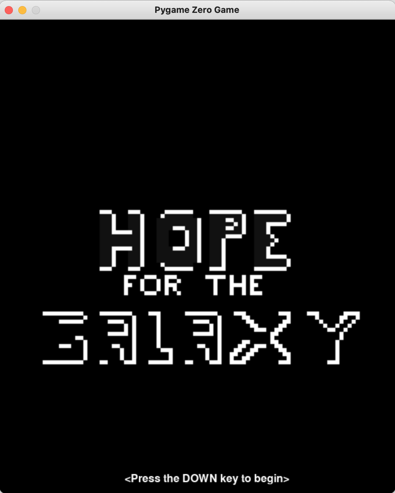
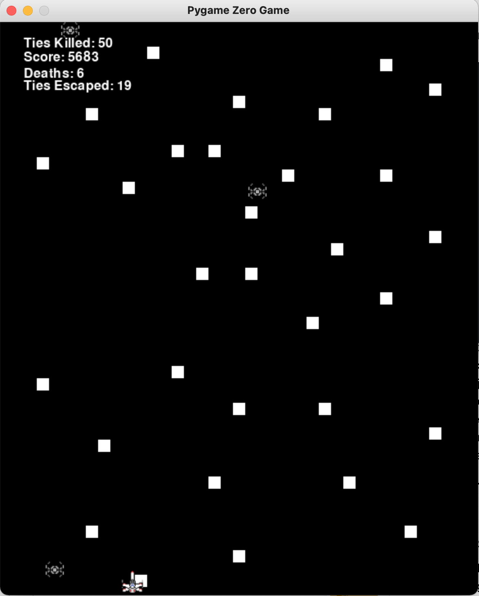
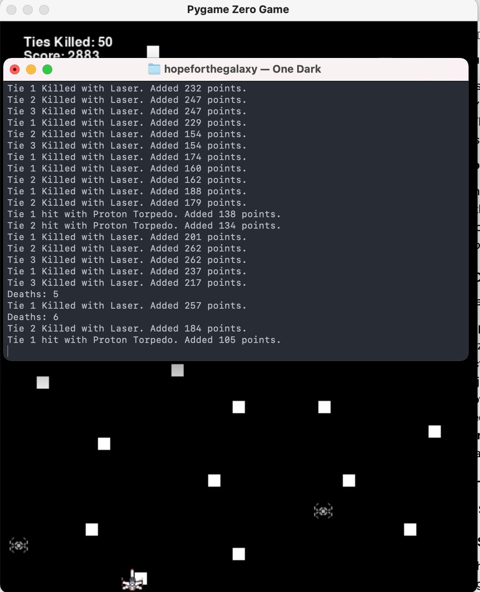
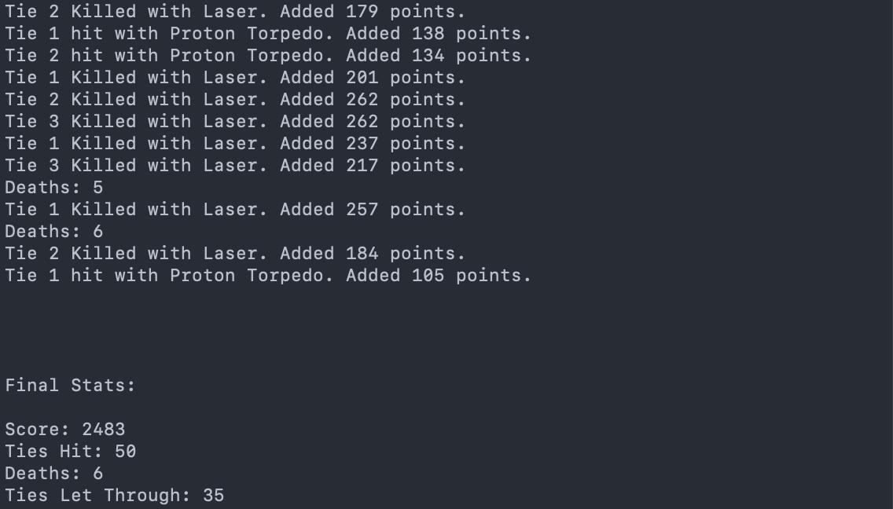

# Hope For the Galaxy

---

## Contents
- [Screenshots](#screenshots)
- [Dependencies](#dependencies)
- [Features](#features)
  - [Ships](#ships)
  - [Abilities](#abilities)
  - [Screens](#screens)
  - [Movement and Interaction](#movement-and-interaction)
  - [Scoring](#scoring)
- [Development Timeline](#development-timeline)
- [Thanks](#thanks)

---

## Screenshots

The Home Screen, shown everytime the game is started.

The Level 1 Screen, with the default X-Wing.

The score logging of the game.

The final stats, displayed when the game is quit.

---

## Dependencies

This project requires the following dependencies:
- **Python 3.9** ***(older versions are not necessarily supported, but will likely work)***
- **Pygame Zero** (`python3 -m pip install pgzero`)
- **Pygame** (`python3 -m pip install pygame`)
- **Pgzrun** (`python3 -m pip install pgzrun`)
- **Time**, **Random**, **OS**, and **System** *(preinstalled with Python 3.9)*

---

## Features

### Ships
The following ships are available. **You must specify at the command line which ship you choose.**
  - **A-Wing** (`python3 main.py awing`)
  - **Millennium Falcon** (`python3 main.py falcon`)
  - **X-Wing** (`python3 main.py xwing`)
  - **Razor Crest** (`python3 main.py razorcrest`)
  - **Y-Wing** (`python3 main.py ywing`)

*In the event that no choice is made or something invalid is given, **the X-Wing acts as default.***

### Abilities
**Three ships have special abilities.** The Millenium Falcon has a "quad laser", the A-Wing has an "ion blast", and the X-Wing has a "proton torpedo". **These can be used with the normal laser accessible by every ship.**

### Screens

A start screen is shown when the game is opened. **Press the down arrow on the start screen to begin the game.**

The level one screen is shown when the start screen is passed. This screen will freeze **when 150 Tie Fighters have been killed, then the game will quit**. In the terminal where it was called from, it will print final stats - the **player's score**, **their deaths**, and **their kills**.

### Movement and Interacton

**The player's ship can move left and right, using the left and right keyboard keys.**

**To fire the basic laser, use the spacebar.** *(This works regardless of ship.)*

**To use a special ability, press the down arrow on the keyboard.** *(This will only work if the ship has a special ability.)*

When the player's ship exits the screen, it will be reset to its original position in the middle of the screen. **A death will be added.**

If a Tie Fighter hits the player's ship, both will die and points will be deducted.

### Scoring
The base scores are as follows:
- **Lasers**: 150 points/Tie Fighter hit
- **Ion Blasts**: 100 points *(this kills all Tie Fighters, but only gains 100 points)*
- **Proton Torpedos**: 100 points/Tie Fighter hit
- **Quad Laser**: 100 points/Tie Fighter hit

All base scores will have the target Tie Fighter's x value *(how far it is away from the bottom of the screen)* **divided by five** added to to it. This means that the farther away from your ship the Tie Fighter is, the more points are gained.

**Score Logging**:

Every time a Tie Fighter is killed, the **Tie's number is logged** along with the **number of points gained** by the player for the hit. It also logs **what weapon killed it**. *(These logs are printed on the console.)*

---

## Development Timeline
*Disclaimer: all data on this timeline is a projection.*

- **September 2021**: Added special abilities for Y-Wing, Razor Crest.
- **October 2021**: Options for more Tie Fighters and adjustable quota
- **November 2021**: Added levels
- **December 2021**: Holiday edition
- **January 2022**: Added ships - B-Wing, V-Wing, Jedi Starfighter
- **No Date**: Death limit, explosion when killed

---

## Bugs or Suggestions

If you encounter a bug or an issue, please report it on this repository's [Issues page](https://github.com/peternielsen112/hopeforthegalaxy/issues). Report a bug with the Bug Report template. Propose a change or feature with the Feature Suggestion template. We look forward to hearing from you.

## Thanks
Special thanks to [Mark Miller](https://github.com/markmillr) for helping with game creation and bug fixing.